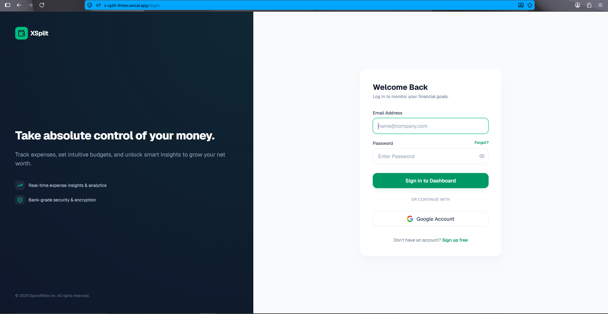
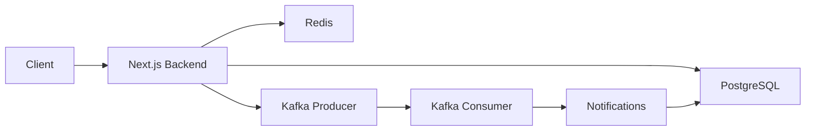
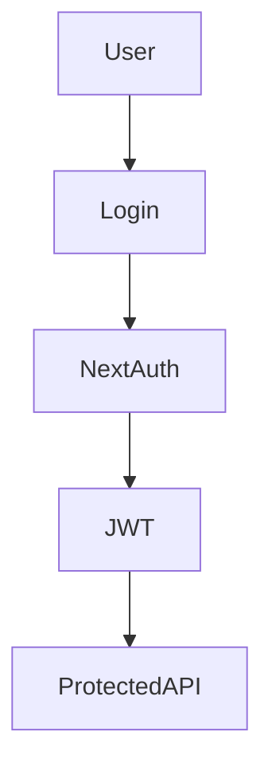
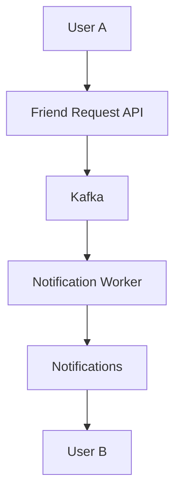
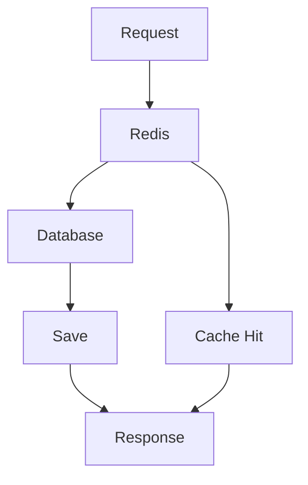
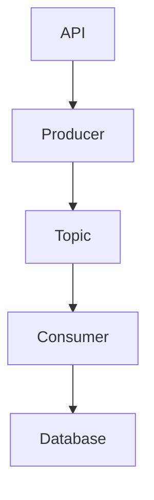
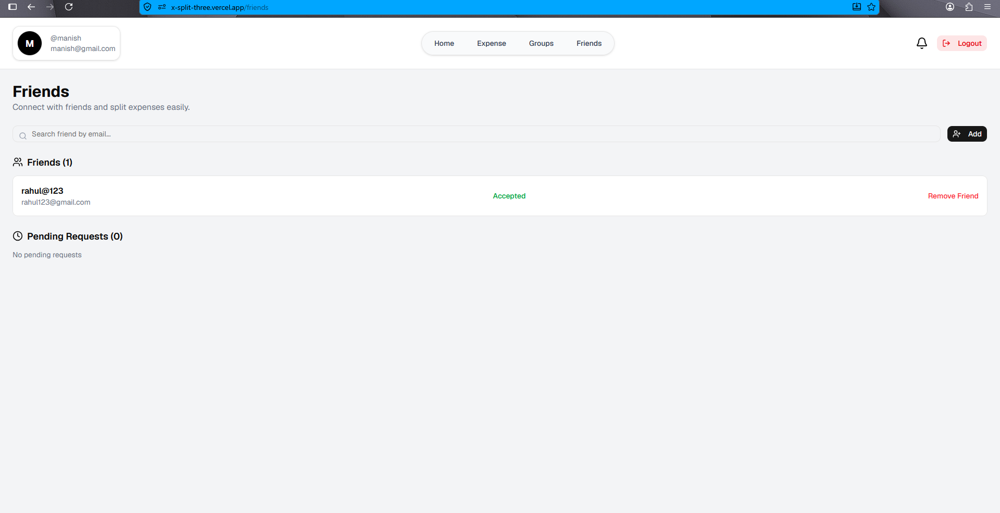
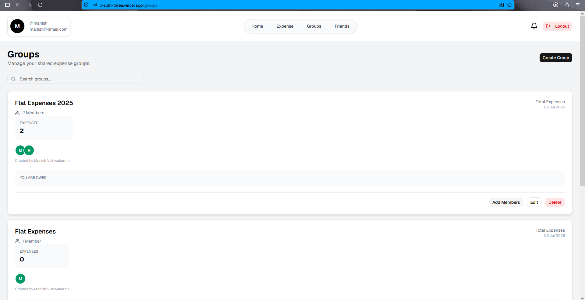
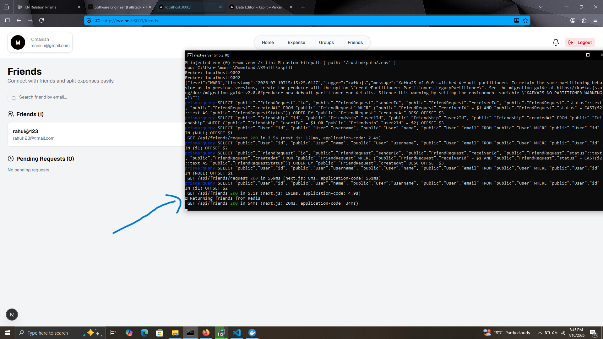
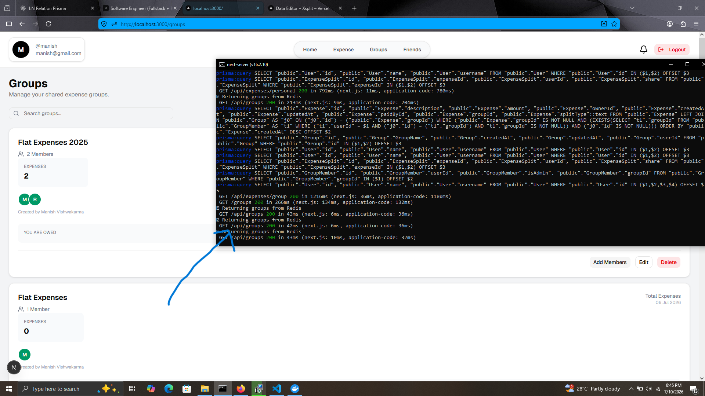

# 🚀 XSplit

<div align="center">

### A modern expense sharing platform inspired by Splitwise

Built with **Next.js 16 • TypeScript • PostgreSQL • Prisma • Kafka • Redis • Docker**

[🌐 Live Demo](https://x-split-three.vercel.app)
•
[📖 Documentation](#documentation)
•
[⚙️ Installation](#installation)

</div>

---

## ✨ Preview

> Add screenshots here

| Login | Dashboard |
|-------|-----------|
|  |  |

---

## ✨ Features

- 🔐 Authentication (NextAuth/Auth.js)
- 👥 Friend Management
- 💰 Personal Expenses
- 👨‍👩‍👧 Group Expenses
- ⚖️ Equal & Unequal Split
- 🔔 Notification System
- ⚡ Kafka Event Streaming
- 🚀 Redis Caching
- 🐳 Dockerized Development
- 📊 PostgreSQL + Prisma ORM
- 📱 Responsive UI
- 🔒 Protected APIs

## 🛠 Tech Stack

| Layer | Technology |
|--------|------------|
| Frontend | Next.js 16, React, TypeScript, TailwindCSS |
| Backend | Next.js Route Handlers |
| ORM | Prisma |
| Database | PostgreSQL |
| Cache | Redis |
| Message Broker | Apache Kafka |
| Authentication | NextAuth |
| Containerization | Docker |
| Deployment | Vercel |

## 🏗 System Architecture



## 🔐 Authentication Flow



## 👥 Friend Request Workflow



## 🚀 Redis Cache Flow



## ⚡ Kafka Workflow



# 📷 Screenshots

## Login


---

## Dashboard


---

## Friends



---

## Groups



---

## Expenses


---

## Kafka Consumer



---

## Redis Cache



# 📡 API Documentation

---

<details>
<summary><b>🔐 Authentication APIs</b></summary>

### Register

```http
POST /api/auth/register
```

#### Request Body

```json
{
  "name": "John Doe",
  "username": "john",
  "email": "john@gmail.com",
  "password": "password123"
}
```

---

### Login

```http
POST /api/auth/login
```

#### Request Body

```json
{
  "email": "john@gmail.com",
  "password": "password123"
}
```

---

### Current User

```http
GET /api/auth/me
```

Returns the currently authenticated user.

</details>

---

<details>
<summary><b>👥 Friends APIs</b></summary>

### Search Users

```http
GET /api/friends/search?q=john
```

---

### Get Friends

```http
GET /api/friends
```

Returns all accepted friends.

---

### Send Friend Request

```http
POST /api/friends/request
```

#### Request Body

```json
{
  "receiverId": 12
}
```

---

### Accept Friend Request

```http
PUT /api/friends/request/accept
```

#### Request Body

```json
{
  "requestId": 5
}
```

---

### Reject Friend Request

```http
PUT /api/friends/request/reject
```

#### Request Body

```json
{
  "requestId": 5
}
```

</details>

---

<details>
<summary><b>👨‍👩‍👧‍👦 Group APIs</b></summary>

### Create Group

```http
POST /api/groups
```

#### Request Body

```json
{
  "name": "Goa Trip"
}
```

---

### Get All Groups

```http
GET /api/groups
```

Returns every group the logged-in user belongs to.

---

### Search Groups

```http
GET /api/groups/search?q=goa
```

---

### Add Member

```http
POST /api/groups/addmember
```

#### Request Body

```json
{
  "groupId": 2,
  "userId": 15
}
```

---

### Get Group Details

```http
GET /api/groups/:id
```

Returns complete group information including members and expenses.

</details>

---

<details>
<summary><b>💰 Expense APIs</b></summary>

### Create Expense

```http
POST /api/expenses
```

#### Request Body

```json
{
  "title": "Dinner",
  "amount": 2500,
  "groupId": 1,
  "splitType": "EQUAL"
}
```

---

### Get Personal Expenses

```http
GET /api/expenses/personal
```

---

### Get Group Expenses

```http
GET /api/expenses/group
```

---

### Search Expenses

```http
GET /api/expenses/search?q=dinner
```

---

### Update Expense

```http
PUT /api/expenses/:id
```

---

### Delete Expense

```http
DELETE /api/expenses/:id
```

</details>

---

<details>
<summary><b>🔔 Notification APIs</b></summary>

### Get Notifications

```http
GET /api/notifications
```

Returns all notifications for the logged-in user.

---

### Mark Notification as Read

```http
PATCH /api/notifications/read
```

#### Request Body

```json
{
  "notificationId": 10
}
```

</details>

---

## 🔒 Authentication

Most APIs require authentication.

Protected endpoints use **NextAuth (Auth.js)** session authentication.

Unauthenticated requests return:

```http
401 Unauthorized
```

---

## 📦 Response Format

### Success

```json
{
  "message": "Success",
  "data": {}
}
```

### Error

```json
{
  "message": "Internal Server Error"
}
```

# ⚙️ Installation

```bash
git clone https://github.com/Mavis47/XSplit

cd XSplit

npm install

docker compose up -d

npx prisma migrate dev

npm run dev
```

# 📂 Project Structure

```text
app/
├── api/
│   ├── auth/
│   ├── expenses/
│   ├── friends/
│   ├── groups/
│   └── notifications/
│
├── components/
├── context/
├── lib/
│   ├── kafka/
│   ├── prisma/
│   └── redis/
│
└── workers/
    └── notification-worker.ts
```

# 🚀 Future Improvements

- Email Notifications
- WebSockets
- Expense Analytics
- OCR Bill Scanner
- Currency Conversion
- Multi-language Support
- Mobile App
